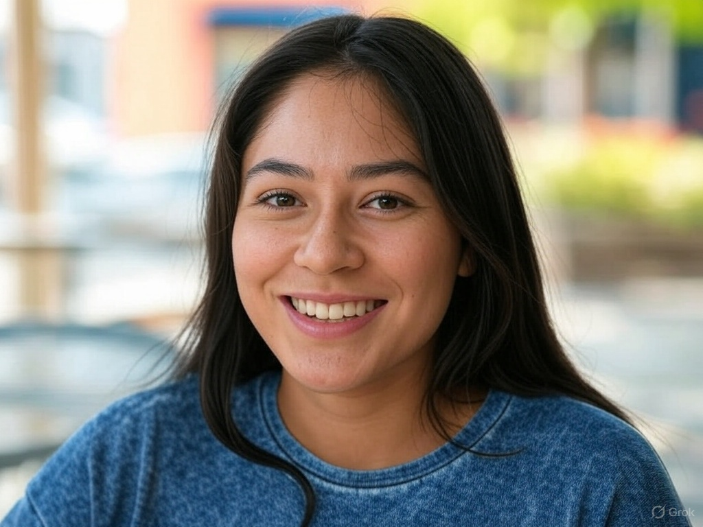

## Day 1: Basic Greetings and Vowel Sounds

### Reading (Spanish):

“Hola, me llamo Ana. ¿Y tú? Yo soy de México.”

### Translation:

“Hello, my name is Ana. And you? I am from Mexico.”

### Pronunciation Focus:

- Spanish vowels: “a” (ah), “e” (eh), “i” (ee), “o” (oh), “u” (oo).
- Practice: Say “Hola” (OH-lah) slowly, emphasizing the open “o” and “a” sounds, which are clearer and more consistent than English vowels.

### Vocabulary:

- Hola = Hello
- Me llamo = My name is
- ¿Y tú? = And you?
- Yo soy = I am
- De = From

### Grammar Concept:

- Word order: Spanish often follows a Subject-Verb-Object order, like English. “Yo soy de México” = “I am from Mexico.”
- No need for articles like “a” or “the” in these basic phrases yet—we’ll add those later!

### Task:

- Read the passage aloud 3 times, focusing on clear vowel sounds.
- Try introducing yourself: “Hola, me llamo [your name]. Yo soy de [your country].”
