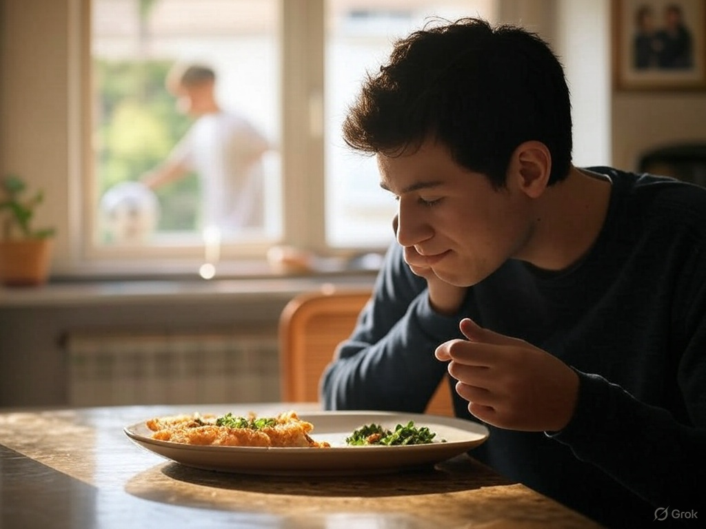

## Day 4: Daily Activities and the “o” Sound

### Reading (Spanish)
“Hola, yo como en casa. Mi hermano juega fútbol. ¿Qué haces tú hoy?”

### Translation  
“Hello, I eat at home. My brother plays soccer. What do you do today?”

### Pronunciation Focus

- The “o” sound: Always “oh” (like “open”), round and steady, never diphthongized like “ow” in English.
- Practice: Say “como” (KOH-moh) and “hoy” (ohy), keeping the “o” pure and strong.

### Vocabulary

- Yo como = I eat
- En casa = At home
- Mi hermano = My brother
- Juega = He plays
- Fútbol = Soccer
- ¿Qué haces tú? = What do you do?
- Hoy = Today

### Grammar Concept

- Present tense verbs: “Como” (I eat) from “comer”; “juega” (he plays) from “jugar.” Spanish verbs change endings based on who’s doing the action—here, “-o” for “I” and “-a” for “he/she.”
- Question word: “¿Qué?” = What?

### Task

- Read the passage aloud 3 times, focusing on the “o” sound in “como” and “fútbol.”
- Practice: “Yo como en casa. ¿Qué haces tú hoy?” Swap “como” with another action (e.g., “leo” = I read).
